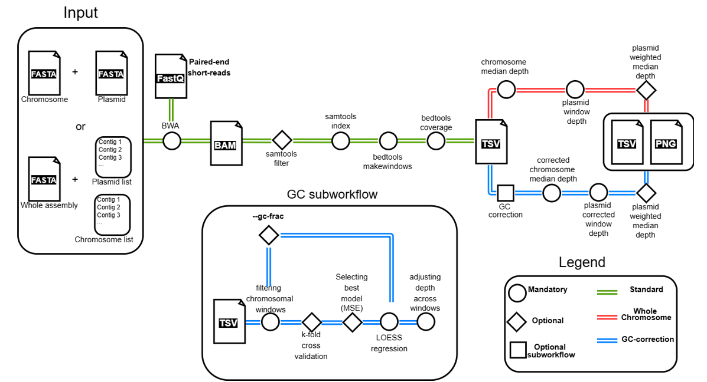

# Plasmid Copy Number Estimator
**P**lasmid **C**opy **N**umber **E**stimator (**PCNE**) is a simple tool to estimate the copy number of plasmid from an assembled genome. <br>
## Introduction
Determining the copy number of plasmids is essential for understanding plasmid biology, evolution, and the dosage of plasmid-borne genes (e.g., antimicrobial resistance genes). PCNE automates this estimation from standard sequencing file formats. <br>

## Requirements
It requires either pre-separated chromosome and plasmid FASTA files or a complete genome assembly FASTA with corresponding contig lists. It also allows to use as plasmid input a multi-fasta file with one contig per plasmid, a complete assembled plasmid (1 contig), or a draft assembled plasmid (one plasmid with multiple contigs). <br>
You can esily get them using tools like [Platon](https://github.com/oschwengers/platon), [MOB-Suite](https://github.com/phac-nml/mob-suite), [PlasmidFinder](https://github.com/genomicepidemiology/plasmidfinder)...

## Pipeline summary
1) Input parsing and file preparation
2) Alignment
3) (Optional) Alignment filtering
4) Windowed data generation
5) (Optional) GC correction
6) Baseline and plasmid depth estimation
7) Plasmid Copy Number Estimation
8) Write output and cleanup

<p align="center">
  

## Dependencies
The tool relies on the following softwares, which will be installed automatically by Conda:<br>
1) **BWA** (tested with v0.7.18)<br>
2) **Samtools** (tested with v1.20)<br>
4) **bedtools** (tested with v2.31.1)
5) **R** (tested with v4.4.3)<br>
6) **R Packages**: readr (v2.1.5), dplyr (v1.1.4), ggplot2(v3.5.2), purrr(v1.0.0)<br>

## Installation
### Bioconda [](http://bioconda.github.io/recipes/pcne/README.html)

Install Plasmid Copy Number Estimator via [BioConda](https://bioconda.github.io/)<br>
1) **Set up Conda Channels:**<br>

```
conda config --add channels defaults
conda config --add channels bioconda
conda config --add channels conda-forge
```
2) **Create a new environment and install:**<br>
```
conda create -n pcne_env -c conda-forge -c bioconda pcne
conda activate pcne_env
```
### Docker [](https://hub.docker.com/explore)
You can use [Docker](https://hub.docker.com/repository/docker/riccabolla/pcne/general):

```
docker pull riccabolla/pcne:2.0.0
docker run riccabolla/pcne:2.0.0 pcne -h
```
### Ubuntu
```
sudo apt install -y bwa samtools r-base bedtools bc
R
install.packages(c("readr", "dplyr", "ggplot2", "purrr"))
q()
git clone https://github.com/riccabolla/PCNE.git 
bash PCNE/bin/pcne -h
```
## Quick Usage
```
pcne -c <chromosome.fasta> -p <plasmid.fasta> -r <reads_R1.fastq.gz> -R <reads_R2.fastq.gz> [-t <threads>] [-o <output_prefix>]
```
## Command line options
```
  -c, --chromosome <file>    Path to chromosome FASTA file (Required)  
  -p, --plasmid <file>       Path to plasmid FASTA file (Required)  
                             Use with `--single-plasmid` if file contains one fragmented plasmid  
  -a, --assembly <file>      Path to the assembled genome FASTA file (Required)  
  -C, --chr-list <file>      Path to file containing chromosome contig names (Required)  
  -P, --plasmid-list <file>  Path to file containing plasmid contig names (Required)  
  -r, --reads1 <file>        Path to forward reads (FASTQ) (Mandatory)  
  -R, --reads2 <file>        Path to reverse reads (FASTQ) (Mandatory)  
  -Q, --min-quality <int>    Minimum mapping quality (MQ) for read filtering (default: OFF)  
  -F, --filter <int>         SAM flag to exclude reads (default: OFF)  
  -l, --plot                 Generate a plot of estimated copy numbers (.png)  
  -s, --single-plasmid       Treat all contigs in `-p` FASTA as one fragmented plasmid  
  --gc-correction            Enable GC-correction
  --gc-frac <float>          Specify LOESS smoothing fraction (default: AUTO)
  --gc-window <int>          Specify windows-size (default: 1000 bp)
  --gc-plot <file>           Generate GC plot
  -t, --threads <int>        Number of threads to use (default: 1)  
  -o, --output <str>         Prefix for output files (default: pcne)  
  -k, --keep-intermediate    Keep intermediate files (default: OFF)  
  -v, --version              Show version information  
  -h, --help                 Show help message 
```

# Run the tool

The tool can be run in two different ways: <br>
**Mode 1**: it requires two separate `FASTA` files for chromosome and plasmid(s). <br>
```
#Example Mode 1
pcne \ 
  -c my_sample.chromosome.fasta \ 
  -p my_sample.plasmid.fasta \ 
  -r my_sample_R1.fastq.gz \ 
  -R my_sample_R2.fastq.gz \ 
  -t 8 \ 
  -o my_sample_pcne
```
**Mode 2**: it requires an assembled `FASTA` file, a list file with contig(s) assigned to chromosome, and a list file of contig(s) assigned to plasmid(S).
The list should be structured as follow:
```
plasmid1_contig
plasmid2_contig
plasmid3_contig
...
```
```
#Example Mode 2
pcne \ 
  -a my_sample_assembly.fasta \
  -C chromosome.list \
  -P plasmid.list \ 
  -r my_sample_R1.fastq.gz \ 
  -R my_sample_R2.fastq.gz \ 
  -t 8 \ 
  -o my_sample_pcne
```
**Note**: if files are not in the working folder, provide the PATH. <br>

For both modes the main output is a `TSV` file. <br>
Example `output.tsv`: <br>

|sample | plasmid_contig |length | mean_depth |baseline_mean_depth |normalization_mode |estimated_copy_number |
|---|---|---|---|---|---|---|
|isolate_1|plasmid_contig_ 1|54321 |152.75|31.45|Whole_Chromosome|4.86|
|isolate_1|plasmid_contig_2_IncFIB|9876|28.50|31.45|Whole_Chromosome|0.91|
|...|...|...|...|...|...|...| 

Columns: <br>
* **sample**: Name of the output file
* **plasmid_contig**: Name of the plasmid contig (from the input plasmid FASTA).<br>
* **length**: Length of the plasmid contig in base pairs.<br>
* **mean_depth**: Average sequencing depth calculated for this plasmid contig.<br>
* **baseline_mean_depth**: Baseline coverage depth.<br>
* **normalization mdoe**: how baseline coverage depth was calculated <br>
* **estimated_copy_number**: The calculated copy number (mean_depth / baseline_mean_depth).<br>

## Summarizing multiple results
After running pcne in batch on multiple isolates, you can use `pcne_summary` to combine all results together and generate a summary plot.

```
cd $working_dir
pcne_summary
```
This will create two files:
* `pcne_summary_all_results.tsv`
* `pcne_summary_plot.png`

## Optional parameters
Optional parameters are designed to enhance overall accuracy, especially under challenging or non-ideal conditions. Each parameter is tunable, allowing the user to find the best combination to fit their data.
### --gc-correction
This flag enables a model-based correction for GC content bias in sequencing data. <br>
Use this option if you suspect your sequencing data may have GC bias, which is common for libraries prepared with PCR amplification steps. If you are using a PCR-free workflow or your control data shows a very flat GC-to-depth profile, this step may not be necessary.
### --min-quality / -Q
This sets the minimum mapping quality (MAPQ) for a read to be included in the analysis. A high score means high confidence; a low score means the read could have aligned equally well to multiple different locations. <br>
Use this to filter out ambiguously mapped reads.
### --filter / -F
This sets the SAM flag used to filter out reads. Use this to exclude reads with undesirable properties (ex. PCR artifacts)

## <a name="Next-features"></a>Next features
### Major updates
#### Long-read only support
This new feature has the goal to extend PCNE usage to experiments where no short-reads are available.

### **License**<br>
This project is licensed under the MIT License - see the [LICENSE](https://github.com/riccabolla/PCNE/blob/main/LICENSE) file for details.<br>

### **Contact** <br>
riccardo.bollini@hunimed.eu <br>

### **Issues**<br>
Please report any issues or suggestions via the GitHub [Issues](https://github.com/riccabolla/PCNE/issues) page.<br>
